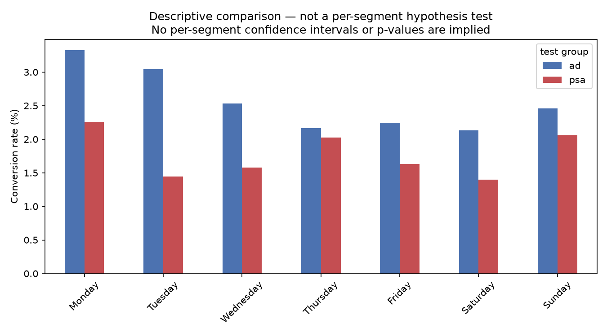

# Marketing A/B Test — Ads vs PSA

**Does a paid ad campaign convert better than a public service announcement, and
is the difference worth paying for?**

The ad campaign produced a statistically robust, timing-independent 43% relative
lift in conversion. This dataset cannot determine whether that lift was
profitable. Profitability depends entirely on two numbers not present in the
data — cost per impression and value per conversion — and at plausible mid-range
assumptions the campaign is marginally loss-making.

That is the finding, not a caveat.

---

## Headline result

| Metric | Value |
|---|---|
| Ad conversion rate | 2.5547% (14,423 / 564,577) |
| PSA conversion rate | 1.7854% (420 / 23,524) |
| Standardized lift | 0.7767 pp, 95% CI [0.6023, 0.9510] pp |
| Relative lift (standardized) | 43.50% |
| Significance | z = 7.3701, p = 8.526e-14 |
| Robust to timing imbalance? | Yes — full specification range 0.7066–0.7934 pp |
| Profitable at mid-range cost assumptions (CPM 5, value 15)? | No — ROI -6.1% at point estimate |

## Recommendation

1. **Continue the campaign.** The lift survives the pessimistic end of the interval.
2. **Obtain the two missing numbers** — cost per impression and value per conversion — before any profitability claim.
3. **Do not reallocate budget by daypart** on this evidence. Timing variables are post-treatment and cannot support a causal claim.
4. Run the proposed daypart experiment (specified in the full report) before revisiting reallocation.

Full reasoning, robustness checks, cost sensitivity tables, and limitations: **[`reports/report.md`](reports/report.md)**.
Decision-by-decision rationale and corrections made mid-analysis: **[`reports/analysis_log.md`](reports/analysis_log.md)**.

---

## Data

[Marketing A/B Testing — faviovaz, Kaggle](https://www.kaggle.com/datasets/faviovaz/marketing-ab-testing)

588,101 users, 7 columns, no nulls, no duplicate user ids. One row per user.

| Column | Type | Note |
|---|---|---|
| Unnamed: 0 | int64 | pandas index artifact, dropped on load |
| user id | int64 | unique |
| test group | object | ad / psa |
| converted | bool | outcome |
| total ads | int64 | post-treatment |
| most ads day | object | post-treatment |
| most ads hour | int64 | post-treatment |

## Reproducing

1. Clone the repo, create a virtual environment, then `pip install -r requirements.txt`.
2. Download `marketing_AB.csv` from the Kaggle link above into `data/raw/`.
3. Run the notebooks in `notebooks/` in order: `01_schema_check.ipynb`, then `02_phase2_hypothesis_test.ipynb`. `02` reproduces the test behind the [Headline result](#headline-result) above and the full statistical results in `reports/report.md`. Running `02` regenerates the figures in `reports/figures/` in place.

## Tools

Python, pandas, numpy, scipy.stats, statsmodels, matplotlib, Jupyter, VS Code, git.
