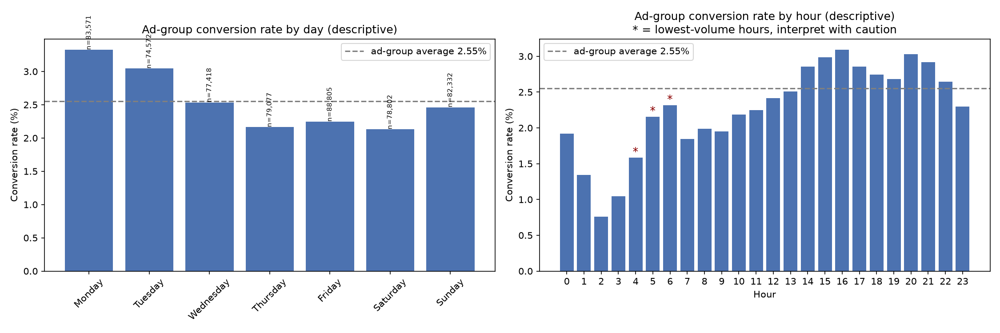

# Marketing A/B Test — Ads vs PSA: Full Analysis

**Does a paid ad campaign convert better than a public service announcement, and
is the difference worth paying for?**

The ad campaign produced a statistically robust, timing-independent 43% relative
lift in conversion. This dataset cannot determine whether that lift was
profitable. Profitability depends entirely on two numbers not present in the
data — cost per impression and value per conversion — and at plausible mid-range
assumptions the campaign is marginally loss-making.

That is the finding, not a caveat.

---

## Recommendation

1. **Continue the campaign.** The lift is 0.7767 pp after standardization, 95% CI
   [0.6023, 0.9510] pp, robust across every specification tested. The decision
   survives the pessimistic end of the interval.
2. **Obtain the two missing numbers** before making any profitability claim: cost
   per impression and gross value per conversion.
3. **Do not reallocate budget by daypart on this evidence.** Run the experiment
   specified below first.
4. **Re-estimate ROI by daypart only if** that experiment confirms a causal
   daypart effect.

### Why not reallocate now

Conversion varies more by timing (1.19 pp across days, 2.33 pp across hours) than
the ad-vs-PSA lift itself (0.77 pp). That looks like an obvious reallocation
opportunity, and it is not actionable, because the timing variables are
post-treatment. The pattern is equally consistent with two explanations that imply
opposite actions:

- those dayparts are genuinely more persuasive, so shifting delivery would raise
  conversions
- users reachable in those windows are simply more conversion-prone, so shifting
  delivery moves impressions without moving conversions

A "monitored reallocation" is not a compromise between these branches. It assumes
the first one.

### Proposed daypart experiment

| Element            | Specification                                                        |
| ------------------ | -------------------------------------------------------------------- |
| Randomization unit | User, assigned before first impression                               |
| Arms               | Delivery restricted to high-performing dayparts vs business-as-usual |
| Primary metric     | Conversion rate per assigned user                                    |
| Secondary metric   | Impressions per user, confirming arms differ in timing not volume    |
| Guardrail          | Assignment logged before delivery, so pre-treatment covariates exist |

Sizing at baseline 2.5547%, power 0.80, alpha 0.05, two-sided:

| MDE     | n per arm | Total n |
| ------- | --------- | ------- |
| 0.25 pp | 65,465    | 130,929 |
| 0.50 pp | 17,083    | 34,167  |
| 0.75 pp | 7,904     | 15,809  |
| 1.00 pp | 4,618     | 9,236   |

A 0.50 pp MDE is ample given the observed spread, requiring 34,167 users — 5.8%
of the 588,101 in this campaign.

This sizing uses the corrected power estimate — an early pass put the 0.50 pp
MDE at ~8,500 per arm, off by roughly 2x from the formal calculation above (see
`analysis_log.md`, "Initial power estimate was off by roughly 2x").

---

## A real number, before the assumed ones

The campaign delivered **14,014,701 impressions** at **24.82 impressions per
user** to produce an estimated **4,385 incremental conversions** — roughly
**3,196 impressions per incremental conversion**.

This figure involves no cost assumption. It is measured. Frequency at that level
is worth examining on its own terms, independently of the scenarios below.

---

## Assumed-cost sensitivity (not derived from data)

The dataset contains no cost or revenue column. Everything in this section is a
scenario, and no figure here should be quoted without its assumption attached.

**Breakeven gross value per conversion**, which requires only a CPM assumption:

| Assumed CPM | CI lower | Point | CI upper |
| ----------- | -------- | ----- | -------- |
| 2           | 8.24     | 6.39  | 5.22     |
| 5           | 20.61    | 15.98 | 13.05    |
| 10          | 41.21    | 31.96 | 26.10    |

At an assumed CPM of 5, the campaign pays for itself only if one conversion is
worth more than about 16 units, or more than 21 under the pessimistic end of the
lift interval. Breakeven is used as the primary output because it needs one
assumption rather than two, and because it is equivalent to the cost per
incremental conversion.

**ROI at the point lift estimate (0.7767 pp):**

|        | value 5 | value 15 | value 40 |
| ------ | ------- | -------- | -------- |
| CPM 2  | -21.8%  | +134.7%  | +525.8%  |
| CPM 5  | -68.7%  | -6.1%    | +150.3%  |
| CPM 10 | -84.4%  | -53.1%   | +25.2%   |

**ROI at the CI lower bound (0.6023 pp):**

|        | value 5 | value 15 | value 40 |
| ------ | ------- | -------- | -------- |
| CPM 2  | -39.3%  | +82.0%   | +385.3%  |
| CPM 5  | -75.7%  | -27.2%   | +94.1%   |
| CPM 10 | -87.9%  | -63.6%   | -2.9%    |

Positive in 4 of 9 combinations at the point estimate, and 3 of 9 at the lower
bound. Exactly one cell changes sign across the lift interval — CPM 10 with value
40, from +25.2% to -2.9% — which is the concrete reason the interval rather than
the point estimate is reported throughout.

---

## Statistical results

| Metric                | Value                              |
| --------------------- | ---------------------------------- |
| Ad conversion rate    | 2.5547% (14,423 of 564,577)        |
| PSA conversion rate   | 1.7854% (420 of 23,524)            |
| Absolute lift         | 0.7692 pp, 95% CI [0.5951, 0.9434] |
| Relative lift         | 43.09%                             |
| One-sided z-test      | z = 7.3701, p = 8.53e-14           |
| Two-sided cross-check | chi2 = 54.01, dof 1, p = 2.00e-13  |
| Standardized lift     | 0.7767 pp, a +0.0074 pp shift      |

### Robustness: does the timing imbalance explain the lift?

No. The groups differ in exposure timing, so the ad group's day x hour
distribution was reweighted to the PSA group's via direct standardization.

| Check                                    | Result                                        |
| ---------------------------------------- | --------------------------------------------- |
| Standardized lift, PSA as reference      | 0.7767 pp (+0.0074 pp vs raw)                 |
| Cells used                               | 168 of 168, 0.0000% reference weight excluded |
| Symmetry check, reverse direction        | 0.7870 pp                                     |
| Leave-one-out, all cells                 | max swing 0.02454 pp                          |
| Leave-one-out, 28 thin cells only        | max swing 0.00279 pp                          |
| Excluding all thin cells (1.067% weight) | 0.7934 pp                                     |
| Excluding 28 highest-weight cells        | 0.7066 pp                                     |

The all-cell leave-one-out swing exceeds the standardization change itself, so it
required explanation rather than reporting alone. Restricting the test to thin
cells (max swing 0.00279 pp) and benchmarking against removal of the 28
highest-weight cells (a 4.2x larger shift) separated the two.

Every specification lands between 0.7066 pp and 0.7934 pp, all inside the primary
confidence interval and all far from zero. Standardized relative lift: 43.50%,
consistent with the raw result (43.09%).

### Randomization diagnostics

| Variable      | chi2   | dof | p        | Cramer's V |
| ------------- | ------ | --- | -------- | ---------- |
| most ads day  | 235.61 | 6   | 4.85e-48 | 0.0200     |
| most ads hour | 192.29 | 23  | 1.10e-28 | 0.0181     |

Significant but negligible in magnitude. The association is detectable only
because n is 588,101. Reporting p = 4.85e-48 without the effect size would
overstate the problem.

Two explanations were tested for the imbalance. A data pipeline fault was rejected
on coverage grounds: zero hours contain no PSA rows, and the PSA-to-ad share ratio
moves smoothly between 0.744 and 1.145 with no value approaching zero. The
direction is internally coherent — PSA is +3.11 pp in business hours, -1.71 pp
late night, -3.39 pp at weekends — consistent with a lighter, more conservative
media buy for the PSA creative.

### Segmentation (ad group only, descriptive not causal)

Overall ad-group conversion rate: 2.5547%.

**By day:**

| Day       | n      | Conversion rate | vs average |
| --------- | ------ | --------------- | ---------- |
| Monday    | 83,571 | 3.3241%         | +0.7695 pp |
| Tuesday   | 74,572 | 3.0440%         | +0.4894 pp |
| Wednesday | 77,418 | 2.5356%         | -0.0191 pp |
| Sunday    | 82,332 | 2.4620%         | -0.0927 pp |
| Friday    | 88,805 | 2.2465%         | -0.3082 pp |
| Thursday  | 79,077 | 2.1637%         | -0.3909 pp |
| Saturday  | 78,802 | 2.1307%         | -0.4240 pp |

**By hour:** trough at 02:00 (0.7570%, n=5,152), rising through the morning, first peak at 16:00 (3.0893%, n=35,963), secondary peak at 20:00–21:00 (~2.97%), tailing off after 22:00.

Day spread (1.19 pp) and hour spread (2.33 pp) both **exceed** the 0.7692 pp topline lift — a result not predicted going in. Rankings restricted to n ≥ 500 and not thin (136 of 168 cells) are led by Tuesday 16:00 (4.5576%, n=4,103), Monday 14:00 (4.4875%, n=6,039), Sunday 20:00 (4.3665%, n=3,733), Monday 15:00 (4.2945%, n=6,357).

The unfiltered top cell (Saturday 05:00, 5.68%) rests on 5 conversions from 88 impressions and is excluded by the n ≥ 500 filter.

---

## Limitations

- **No pre-treatment covariates exist.** `total ads`, `most ads day` and
  `most ads hour` are all post-treatment, derived from exposure behaviour after
  assignment. A genuine randomization check is therefore impossible on this
  dataset. Observed timing differences are consistent with differing delivery
  schedules rather than assignment bias, but that cannot be confirmed.
- **No cost or revenue data.** All profitability figures are labelled scenarios.
- **Day and hour segmentation is descriptive, not causal.** No per-segment
  hypothesis tests were run and no reallocation is recommended on that basis.
- **Design imbalance of 96% ads to 4% PSA.** The PSA estimate remains usable —
  its CI width of 0.338 pp is well below the 0.769 pp gap — but is far less
  precise.
- **Small-cell caution.** The unfiltered top-performing cell was Saturday 05:00
  at 5.68%, resting on 5 conversions from 88 impressions. Rankings use an
  n >= 500 filter.

---

## Data

[Marketing A/B Testing — faviovaz, Kaggle](https://www.kaggle.com/datasets/faviovaz/marketing-ab-testing)

588,101 users, 7 columns, no nulls, no duplicate user ids. One row per user.

| Column        | Type   | Note                                   |
| ------------- | ------ | -------------------------------------- |
| Unnamed: 0    | int64  | pandas index artifact, dropped on load |
| user id       | int64  | unique                                 |
| test group    | object | ad / psa                               |
| converted     | bool   | outcome                                |
| total ads     | int64  | post-treatment                         |
| most ads day  | object | post-treatment                         |
| most ads hour | int64  | post-treatment                         |
